# Yhangry — Partner Signal Scraper & Enrichment Engine

A robust, intelligent data pipeline designed to discover, verify, and enrich potential yhangry B2B partnership candidates (luxury property management companies, villa operators, concierge businesses) in any target location.

**Input:** A target market/location (e.g. `"London"`, `"Ibiza"`, `"Tuscany"`)  
**Output:** Enriched partner profiles as a structured JSON array, ready to feed into the scoring model.

---

## Graceful Degradation & API Integrations

The scraper is designed with **graceful fallback architecture**. It works out-of-the-box using free tools, but automatically unlocks enterprise-grade intelligence if API keys are supplied in a `.env` file:

| Pipeline Step | Enhanced Mode (With API Keys) | Free Fallback Mode (Without API Keys) |
|---|---|---|
| **Layer 1: Discovery** | **Google Places API** — Operational businesses, official websites, phone numbers, and ratings. | **DuckDuckGo Search** — Direct scraping across 5 search templates (no API key needed). |
| **Layer 3a: Verification** | **UK Companies House API** — Fetches status, SIC codes, director name, and incorporation year. | **Skipped** — Gracefully omitted if API key is not supplied. |
| **Layer 3b: Enrichment** | **Groq LLM (Llama 3.1 8B)** — Deep semantic understanding (Luxury tier classification, true business-type confirmation, PMS tool extraction). | **Regex / Keyword Rules** — Matches luxury keywords, concierge phrases, high ADR patterns, and PMS platforms. |

---

## How It Works

The engine coordinates a 3-layer pipeline to discover, scrape, verify, and enrich B2B partner leads:

```mermaid
sequenceDiagram
    autonumber
    actor CLI as 👤 User (CLI)
    participant Main as main.py
    participant Scraper as scraper.py
    participant Places as Google Places API
    participant DDG as DuckDuckGo Search
    participant CompHouse as Companies House API
    participant Enricher as enricher.py
    participant Groq as Groq API (Llama 3.1)
    participant Schema as schema.py (Pydantic)
    participant Disk as 💾 Output JSON

    CLI->>Main: python main.py --location "London" --limit 25

    rect rgb(20, 40, 80)
        Note over Main,DDG: ── LAYER 1: DISCOVERY ──────────────────────────────
        Main->>Scraper: discover_companies(location="London", limit=25)

        alt Google Places API key is set
            Scraper->>Places: POST /places:searchText (3 query variants)
            Places-->>Scraper: Places with websiteUri & businessStatus
            Scraper->>Scraper: Filter OPERATIONAL only, dedupe by domain
        else Fallback — no Google Places key
            loop 5 query templates (luxury, villa, STR, concierge, vacation)
                Scraper->>DDG: ddgs.text(query, max_results=N)
                DDG-->>Scraper: Search hits (title, href, body snippet)
                Scraper->>Scraper: _clean_title() strips " | ", " - " suffixes
                Scraper->>Scraper: _extract_domain() normalises URL to root domain
                Scraper->>Scraper: Drop if domain in BLOCKLIST_DOMAINS
                Note right of Scraper: Blocklist: Airbnb, Booking.com,<br/>LinkedIn, RightMove, BBC…
            end
        end

        Scraper-->>Main: List[Dict] — [{company_name, domain, source_url, snippet}]
    end

    loop For each discovered company (i of N)

        rect rgb(20, 60, 40)
            Note over Main,Scraper: ── LAYER 2: SCRAPE WEBSITE ─────────────────────────
            Main->>Scraper: scrape_website(source_url)
            Scraper->>Scraper: requests.get(url, headers=HEADERS, timeout=10)
            Scraper->>Scraper: BeautifulSoup parse HTML

            Note over Scraper: Extract links BEFORE decomposing tags<br/>(href / src → detect PMS domains & mailto)
            Scraper->>Scraper: Collect all href/src from a, iframe, script, link
            Scraper->>Scraper: Decompose script, style, head, meta, svg tags
            Scraper->>Scraper: soup.get_text() → collapse whitespace
            Scraper->>Scraper: Truncate text to (char_limit - url_block_size)
            Scraper->>Scraper: Append [HIDDEN_URLS] block at end

            Scraper-->>Main: cleaned_text (up to 6000 chars)
        end

        rect rgb(60, 30, 60)
            Note over Main,CompHouse: ── LAYER 3a: COMPANIES HOUSE VERIFICATION ──────────
            opt COMPANIES_HOUSE_API_KEY is set
                Main->>CompHouse: GET /search/companies?q={name}
                CompHouse-->>Main: company_number, status
                Main->>CompHouse: GET /company/{company_number}
                CompHouse-->>Main: date_of_creation, sic_codes, company_status
                Main->>CompHouse: GET /company/{company_number}/officers
                CompHouse-->>Main: officers list → director_name

                Main->>Main: Merge into company dict<br/>(verified, status, SIC codes, incorporation year)
            end
        end

        rect rgb(60, 40, 10)
            Note over Main,Groq: ── LAYER 3b: ENRICHMENT & SIGNAL EXTRACTION ────────
            Main->>Enricher: enrich(company, scraped_text)
            Enricher->>Enricher: full_text = scraped_text + " " + snippet

            Note over Enricher: ── RegEx / Dictionary pass (always runs) ──
            Enricher->>Enricher: extract_luxury_keywords() — 26 luxury terms
            Enricher->>Enricher: extract_concierge_signal() — chef, butler, etc.
            Enricher->>Enricher: extract_property_count() — regex portfolio size
            Enricher->>Enricher: detect_high_adr() — £500+/night price patterns
            Enricher->>Enricher: detect_pms() — 30 PMS platform names
            Enricher->>Enricher: detect_channels() — Airbnb, VRBO, Booking…
            Enricher->>Enricher: detect_markets() — 33 luxury market names
            Enricher->>Enricher: extract_email() — regex mailto fallback

            opt GROQ_API_KEY set AND website scraped successfully
                Note over Enricher,Groq: ── LLM pass (overrides/augments regex) ──
                Enricher->>Groq: Chat completion — Llama 3.1 8B Instant<br/>Extract: is_property_manager, luxury_tier,<br/>property_count, concierge_fit,<br/>pms_software, geographic_markets
                Groq-->>Enricher: Raw JSON object (response_format: json_object)
                Enricher->>Enricher: Merge LLM fields over regex results<br/>(LLM wins on property_count, tier, concierge)
                Enricher->>Enricher: Union geographic_markets lists
                Enricher->>Enricher: Append pms_software to pms_detected
            end

            Enricher-->>Main: enriched Dict (all signals + pipeline meta)
        end

        rect rgb(30, 30, 60)
            Note over Main,Schema: ── SCHEMA VALIDATION ───────────────────────────────
            Main->>Schema: PartnerProfile(**enriched)

            alt Validation passes
                Schema-->>Main: Typed PartnerProfile object
                Main->>Main: profiles.append(profile)
            else Validation fails (type mismatch, etc.)
                Schema-->>Main: ValidationError
                Main->>Main: log.warning() and skip company
            end
        end

    end

    rect rgb(10, 50, 50)
        Note over Main,Disk: ── OUTPUT ───────────────────────────────────────────
        Main->>Main: [p.model_dump() for p in profiles]
        Main->>Disk: json.dump → partners_{location}.json
        Main-->>CLI: Pipeline summary (discovered / enriched / snippet-only)
    end
```



---

## Quick Start

### 1. Installation

Clone this repository, navigate to the folder, and install the dependencies:

```bash
pip install -r requirements.txt
```

### 2. Configure Environment Variables (Optional)

Create a `.env` file in the root of `yhangry-signal-scraper/` (use `.env.example` as a template):

```bash
cp .env.example .env
```

Open `.env` and fill in the API keys for the services you want to enable:
```ini
# Google Places API key (Text Search)
GOOGLE_PLACES_API_KEY=your_google_places_key

# UK Companies House API Key (Basic Auth Key)
COMPANIES_HOUSE_API_KEY=your_companies_house_key

# Groq API Key (for LLM extraction)
GROQ_API_KEY=your_groq_api_key
```
*Note: If no `.env` is created, the pipeline will still run perfectly using DuckDuckGo search + local regex parsing.*

### 3. Run the Pipeline

Run the scraping command from your terminal:

```bash
# Run for London, discover up to 25 companies
python3 main.py --location "London" --limit 25

# Run for Ibiza, discover up to 10 companies
python3 main.py --location "Ibiza" --limit 10

# Customize the output directory
python3 main.py --location "Tuscany" --limit 30 --output results/
```

---

## Output Schema

The output is written to a JSON array containing structured objects that strictly validate against our Pydantic model (`schema.py`):

```json
{
  "company_name": "Under The Doormat",
  "domain": "underthedoormat.com",
  "source_url": "https://underthedoormat.com",
  "location_searched": "London",
  "snippet": "Premium short term rentals in London. Fully managed service with bespoke hospitality.",
  "estimated_property_count": 300,
  "geographic_markets": [
    "London"
  ],
  "luxury_keywords_found": [
    "luxury",
    "bespoke",
    "exclusive",
    "concierge"
  ],
  "luxury_keyword_count": 4,
  "high_adr_signals": true,
  "concierge_mentioned": true,
  "pms_detected": [
    "Guesty"
  ],
  "channel_managers": [
    "Airbnb",
    "Booking.com"
  ],
  "contact_email": "bookings@underthedoormat.com",
  "companies_house_verified": true,
  "company_status": "active",
  "sic_codes": [
    "55209"
  ],
  "director_name": "SMITH, John",
  "incorporation_year": 2014,
  "is_property_manager": true,
  "luxury_tier": "luxury",
  "groq_extraction_success": true,
  "data_sources": [
    "duckduckgo_search",
    "website_scrape",
    "companies_house",
    "groq_llm"
  ],
  "enrichment_success": true
}
```

### Schema Field Classifications:
* **Identity**: `company_name`, `domain`, `source_url`, `location_searched`, `snippet`
* **Scale Signals**: `estimated_property_count` (int), `geographic_markets` (list)
* **Quality Signals**: `luxury_keywords_found`, `luxury_keyword_count`, `high_adr_signals`, `concierge_mentioned` (ideal alignment with yhangry)
* **Tech Stack**: `pms_detected` (e.g. Guesty, Hostaway), `channel_managers` (e.g. Airbnb)
* **Companies House Verification (Layer 3a)**: `companies_house_verified`, `company_status`, `sic_codes`, `director_name`, `incorporation_year`
* **LLM Enrichment (Layer 3b)**: `is_property_manager` (bool classification), `luxury_tier` (budget / mid / luxury / ultra), `groq_extraction_success`
* **Pipeline Metadata**: `data_sources` (tracks which APIs/engines enriched the profile), `enrichment_success`

---

## File Structure

```
yhangry-signal-scraper/
├── main.py          # CLI entrypoint + pipeline coordinator
├── scraper.py       # Layer 1 (Discovery - Google Places/DDG) & Layer 2 (Scraping)
├── enricher.py      # Layer 3: GTM signal extraction (Groq LLM + regex rules)
├── schema.py        # Pydantic model contract for output validation
├── .env.example     # Configuration file template
├── requirements.txt # Project dependencies
└── sample_output/   # Generated partner profiles (JSON)
```
